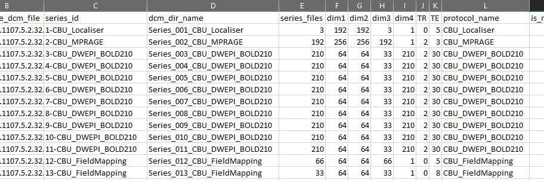
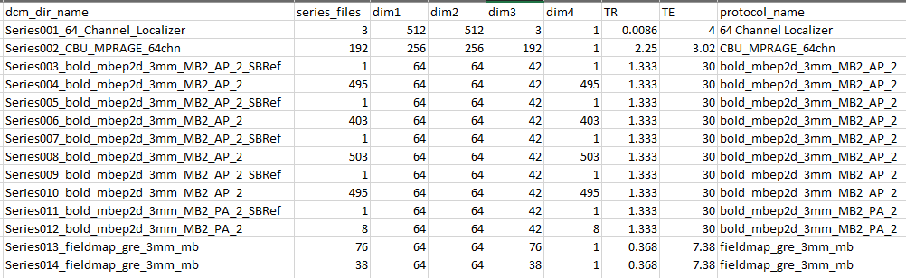

# Converting CBU MRI DICOM data to BIDS format

## Table of contents

- [Converting CBU MRI DICOM data to BIDS format](#converting-cbu-mri-dicom-data-to-bids-format)
  - [Table of contents](#table-of-contents)
  - [Introduction](#introduction)
  - [Installation](#installation)
    - [Using CBU Linux cluster](#using-cbu-linux-cluster)
    - [If not using CBU Linux cluser](#if-not-using-cbu-linux-cluser)
  - [The main steps](#the-main-steps)
  - [Where are your raw data](#where-are-your-raw-data)
  - [DICOM to BIDS using HeuDiConv](#dicom-to-bids-using-heudiconv)
    - [Step 1: Discovering your scans](#step-1-discovering-your-scans)
    - [Step 2: Creating a heuristic file](#step-2-creating-a-heuristic-file)
    - [Step 3: Converting the data](#step-3-converting-the-data)
  - [Converting multiple subjects in parallel using SLURM](#converting-multiple-subjects-in-parallel-using-slurm)
    - [Example 1](#example-1)
    - [Example 2 (recommended)](#example-2-recommended)
      - [A generic HeuDiConv script](#a-generic-heudiconv-script)
      - [Project-specific script with the "sbatch" command](#project-specific-script-with-the-sbatch-command)
      - [Checking your job status](#checking-your-job-status)
  - [Validate the BIDS dataset](#validate-the-bids-dataset)
  - [More use cases](#more-use-cases)
    - [Multi-band acquisition with single-band reference scans ("sbref")](#multi-band-acquisition-with-single-band-reference-scans-sbref)
    - [Multi-echo data](#multi-echo-data)
  - [Code examples](#code-examples)

## Introduction

To start working with your MRI data, you need to convert the raw `DICOM` format data to `NIfTI` format and organise them according to the [BIDS standard](https://bids-specification.readthedocs.io/en/stable/). This tutorial outlines how to do that for CBU MRI data. If you have any questions, please email [Dace Apšvalka](https://www.mrc-cbu.cam.ac.uk/people/dace.apsvalka/). The example scripts described in this tutorial are available in the [code](code) directory.

## Installation

Download the scripts from this repository's [code](code) folder to your local folder.

### Using CBU Linux cluster

This tutorial assumes that you are running the conversion on the CBU Linux cluster. All required packages are installed on the CBU cluster under the `heudiconv` conda environment. It will be activated by the scripts themselves, you don't have to activate it.

### If not using CBU Linux cluser

If you are not running the conversion on the CBU cluster, you need to have the following installed:

- Python 3.6 or later
- [heudiconv](https://heudiconv.readthedocs.io/en/latest/) `pip install heudiconv`
- [dcm2niix](https://github.com/rordenlab/dcm2niix) `pip install dcm2niix`

To automatically create an environment with the required packages, you can use the [environment.yml](code/dicom_to_bids_single_subject.sh) file available in the [code](code) directory. To do that use the following command: `conda env create -f environment.yml`. It will create a conda environment called `heudiconv`. The activation of the `heudiconv` environment is integrated in the scripts.

## The main steps

1. **Obtain the Scripts.** Download the example scripts from this repository's [code](code) folder.

2. **Customize the Heuristic File.** Modify the `bids_heuristic.py` file according to the specifics of your data. To do this, you may first need to run `dicom_discover.sh` to get detailed information of what types of scans you have collected.

3. **Update the Python Script.** Edit the *dicom_to_bids_multiple_subjects.py* script. You'll need to enter your project details in the designated section at the top of the script. This includes paths, subject IDs, and other relevant information.

4. **Execute the Script.** Open the terminal and navigate to the directory where *dicom_to_bids_multiple_subjects.py* is located. Run the script by typing: `./dicom_to_bids_multiple_subjects.py`. This command initiates the conversion process.

**More detailed instructions are provided in the sections below.**

## Where are your raw data

The raw data from the CBU MRI scanner are stored at `/mridata/cbu/[subject code]_[project code]`. You can see all your participant scan directories by typing a command like this in a terminal (replace *MR09029* with your project code):

```bash
ls -d /mridata/cbu/*_MR09029

/mridata/cbu/CBU090817_MR09029
/mridata/cbu/CBU090924_MR09029
/mridata/cbu/CBU090928_MR09029
/mridata/cbu/CBU090931_MR09029
...
```

Each subject has a unique CBU code. You can find a specific subject's scans, by their code. For example, to see the contents of subject with a code `CBU090817`, you can type a command like this in the terminal:  

```bash
ls -d /mridata/cbu/CBU090817_*/*/*

/mridata/cbu/CBU090817_MR09029/20090803_083228/Series_001_CBU_Localiser/
/mridata/cbu/CBU090817_MR09029/20090803_083228/Series_002_CBU_MPRAGE/
/mridata/cbu/CBU090817_MR09029/20090803_083228/Series_003_CBU_DWEPI_BOLD210/
/mridata/cbu/CBU090817_MR09029/20090803_083228/Series_004_CBU_DWEPI_BOLD210/
/mridata/cbu/CBU090817_MR09029/20090803_083228/Series_005_CBU_DWEPI_BOLD210/
/mridata/cbu/CBU090817_MR09029/20090803_083228/Series_006_CBU_DWEPI_BOLD210/
/mridata/cbu/CBU090817_MR09029/20090803_083228/Series_007_CBU_DWEPI_BOLD210/
/mridata/cbu/CBU090817_MR09029/20090803_083228/Series_008_CBU_DWEPI_BOLD210/
/mridata/cbu/CBU090817_MR09029/20090803_083228/Series_009_CBU_DWEPI_BOLD210/
/mridata/cbu/CBU090817_MR09029/20090803_083228/Series_010_CBU_DWEPI_BOLD210/
/mridata/cbu/CBU090817_MR09029/20090803_083228/Series_011_CBU_DWEPI_BOLD210/
/mridata/cbu/CBU090817_MR09029/20090803_083228/Series_012_CBU_FieldMapping/
/mridata/cbu/CBU090817_MR09029/20090803_083228/Series_013_CBU_FieldMapping/
```

The first part of the folder name which follows the project code, is the data acquisition date. E.g., the data of the subject above was acquired on Aug-03-2009 (*20090803*)

Each `Series###` folder contains DICOM files of the particular scan. The name of the folder is the same as what a radiographer named the scan in the MRI console. Usually, the name is very indicative of what type of scan it is. In the example above, we acquired a T1w anatomical/structural scan (MPRAGE), nine functional scans (BOLD), and two field maps. The *Series_001_CBU_Localiser* scan is a positional scan for the MRI and can be ignored.

Each of these folders contains DICOM (`.dcm`) files, typically, one file per slice for structural scans or one file per volume for functional scans. These files contain a header with the metadata (e.g., acquisition parameters) and the actual image itself. DICOM is a standard format for any medical image, not just the brain. To work with the brain images, we need to convert the DICOM files to NIfTI format which is a cross-platform and cross-software standard for brain images. Along with having the files in NIfTI format, we need to name and organise them according to BIDS standard.

Several DICOM-to-BIDS conversion tools exist (see a full list [here](https://bids.neuroimaging.io/benefits#converters)). We recommend using [HeuDiConv](https://heudiconv.readthedocs.io/en/latest/index.html).

## DICOM to BIDS using HeuDiConv

On the CBU cluster, HeuDiConv is available in a conda environment called *heudiconv*. (You can see all available *conda* environments by typing `conda env list` command in the terminal.)

HeuDiConv does the following:

- converts DICOM (.dcm) files to NIfTI format (`.nii` or `.nii.gz`);
- generates their corresponding metadata files (`.json`);
- renames the files and organises them in folders following BIDS specification;
- generates several other `.json` and `.tsv` files required by BIDS.

The final result of DICOM Series being converted into BIDS for our example subject above would be this:

```console
├── sub-01
│   ├── anat
│   │   ├── sub-01_T1w.json
│   │   └── sub-01_T1w.nii.gz
│   ├── fmap
│   │   ├── sub-01_acq-func_magnitude1.json
│   │   ├── sub-01_acq-func_magnitude1.nii.gz
│   │   ├── sub-01_acq-func_magnitude2.json
│   │   ├── sub-01_acq-func_magnitude2.nii.gz
│   │   ├── sub-01_acq-func_phasediff.json
│   │   └── sub-01_acq-func_phasediff.nii.gz
│   ├── func
│   │   ├── sub-01_task-facerecognition_run-01_bold.json
│   │   ├── sub-01_task-facerecognition_run-01_bold.nii.gz
│   │   ├── sub-01_task-facerecognition_run-01_events.tsv
│   │   ├── sub-01_task-facerecognition_run-02_bold.json
│   │   ├── sub-01_task-facerecognition_run-02_bold.nii.gz
│   │   ├── sub-01_task-facerecognition_run-02_events.tsv
│   │   ├── sub-01_task-facerecognition_run-03_bold.json
│   │   ├── sub-01_task-facerecognition_run-03_bold.nii.gz
│   │   ├── sub-01_task-facerecognition_run-03_events.tsv
│   │   ├── sub-01_task-facerecognition_run-04_bold.json
│   │   ├── sub-01_task-facerecognition_run-04_bold.nii.gz
│   │   ├── sub-01_task-facerecognition_run-04_events.tsv
│   │   ├── sub-01_task-facerecognition_run-05_bold.json
│   │   ├── sub-01_task-facerecognition_run-05_bold.nii.gz
│   │   ├── sub-01_task-facerecognition_run-05_events.tsv
│   │   ├── sub-01_task-facerecognition_run-06_bold.json
│   │   ├── sub-01_task-facerecognition_run-06_bold.nii.gz
│   │   ├── sub-01_task-facerecognition_run-06_events.tsv
│   │   ├── sub-01_task-facerecognition_run-07_bold.json
│   │   ├── sub-01_task-facerecognition_run-07_bold.nii.gz
│   │   ├── sub-01_task-facerecognition_run-07_events.tsv
│   │   ├── sub-01_task-facerecognition_run-08_bold.json
│   │   ├── sub-01_task-facerecognition_run-08_bold.nii.gz
│   │   ├── sub-01_task-facerecognition_run-08_events.tsv
│   │   ├── sub-01_task-facerecognition_run-09_bold.json
│   │   ├── sub-01_task-facerecognition_run-09_bold.nii.gz
│   │   └── sub-01_task-facerecognition_run-09_events.tsv
│   └── sub-01_scans.tsv
```

All files belonging to this subject are in the *sub-01* folder. The structural image is stored in the *anat* subfolder, field maps in *fmap*, and functional images in the *func* subfolders. Each file is accompanied by its `.json` file that contains the metadata, such as acquisition parameters. For the functional images, in addition to the metadata files, an events file is generated for each functional run. The file names follow the [BIDS specification](https://bids-standard.github.io/bids-starter-kit/folders_and_files/files.html).

HeuDiConv needs information on how to translate your specific DICOMs into BIDS. This information is provided in a [heuristic file](https://heudiconv.readthedocs.io/en/latest/heuristics.html) that the user creates. 

At the moment, at the CBU we don't use a standard for naming our raw scans in the MRI console. Therefore we don't have a standard heuristic (rules) that we could feed to HeuDiConv for any of our projects. You need to create this heuristic file yourself for your specific project. You can use existing examples as a guideline.

To create the heuristic file, you need to know what scans you have, which ones you want to convert (you don't have to convert all scans, only the ones you need for your project), and how to uniquely identify each scan based on its metadata.

As such, **converting DICOM data to BIDS using HeuDiConv involves 3 main steps**:

 1. Discovering what DICOM series (scans) there are in your data
 2. Creating a heuristic file specifying how to translate the DICOMs into BIDS
 3. Converting the data

### Step 1: Discovering your scans

First, you need to know what scans there are and how to uniquely identify them by their metadata. You could look in each scan's DICOM file metadata manually yourself, but that's not very convenient. Instead, you can 'ask' HeuDiConv to do the scan discovery for you. If you run HeuDiConv without NIfTI conversion and heuristic, it will generate a *DICOM info* table with all scans and their metadata. Like this:



The column names are metadata fields and rows contain their corresponding values.

To get such a table, you'd write a simple `bash script`, like this [dicom_discover.sh](code/dicom_discover.sh) script, explained below. You can create and edit the script in any text editor. The file extension for bash scripts is `.sh`. I named my script `dicom_discover.sh`.

A bash script must always start with `#!/bin/bash`.

Specify your project's directory. Below I specified my path for this tutorial.

```bash
PROJECT_PATH='/imaging/correia/da05/wiki/BIDS_conversion/MRI'
```

Specify the DICOM data directory for any of your project's subjects, let's say the first one. We are assuming here that all subjects in your project have the same type of scans acquired and we can use a single heuristic file for the project.

```bash
DICOM_PATH='/mridata/cbu/CBU090942_MR09029'
```

Specify where you want the output data to be saved. I specified the output to go in the *work* directory. The *work* directory, in my case, is a temporary directory where I want my intermediate files to go. I will delete this directory once I have finished data preprocessing.

```bash
OUTPUT_PATH="${PROJECT_PATH}/work/dicom_discovery/"
```

Specify this subject's ID. In this case, it can be any, as we will only use this subject to get the information about DICOMs in our project.

```bash
SUBJECT_ID='01'
```

To use the HeuDiConv, you first need to activate the environment which has HeuDiConv and dcm2niix packages. In our case, we can use *heudiconv* environment that is on our system.

```bash
conda activate heudiconv
```

Now, we can run the HeuDiConv with the following parameters:

- `--files`: We specify that all our DICOM files are located in the */mridata/cbu/CBU090942_MR09029/[all subdirectories]/[all subdirectories]/[all files ending with .dcm]*
- `--outdir`: Where to output the results.
- `--heuristic`: In this case, we want to discover all scans, not applying any rules.
- `--subjects`: Subject's ID how it will appear in the output.
- `--converter`: In this case, we don't want to do the file conversion to NIfTI, we just want to discover what files we have.
- `--bids`: Flag for output into BIDS structure.
- `--overwrite`: Flag to overwrite existing files.

```bash
heudiconv \
    --files "${DICOM_PATH}"/*/*/*.dcm \
    --outdir "${OUTPUT_PATH}" \
    --heuristic convertall \
    --subjects "${SUBJECT_ID}" \
    --converter none \
    --bids \
    --overwrite
```

At the end, we deactivate the environment.

```bash
conda deactivate
```

Once you have created and saved your script, you can execute it. To do that, in a terminal, navigate to the directory where your script is located (I recommend putting your scripts in the [PROJECT_PATH]/code/ directory), e.g., in my case it would be:

```console
cd /imaging/correia/da05/wiki/BIDS_conversion/MRI/code
```

And then run this command:

```console
./dicom_discover.sh
```

If everything is working fine, you will see an output like this:

```console
WARNING: Could not check for version updates: Connection to server could not be made
INFO: Running heudiconv version 0.11.6 latest Unknown
INFO: Analyzing 7145 dicoms
...
INFO: PROCESSING DONE: {'subject': '01', 'outdir': '/imaging/correia/da05/wiki/BIDS_conversion/MRI/work/dicom_discovery/', 'session': None}
```

Once the processing has finished, the table that we are interested in will be located at `OUTPUT_PATH/.heudiconv/[subject ID]/info/dicominfo.tsv`. The *.heudiconv* directory is a hidden directory and you might not be able to see it in your file system. If so, either enable to view hidden files, or copy the *dicominfo.tsv* to some other location. For example, your home (U: drive) Desktop:

```bash
cp /imaging/correia/da05/wiki/BIDS_conversion/MRI/work/dicom_discovery/.heudiconv/01/info/dicominfo.tsv ~/Desktop
```

Now, you can open the file, for example, in MS Excel and keep it open for the next step - creating a heuristic file.

### Step 2: Creating a heuristic file

The heuristic file must be a `Python` file. You can create and edit Python files in any text editor, but it would be more convenient to use a code editor or, even better, an *integrated development environment* (IDE), such as [VS Code](https://code.visualstudio.com/).

You can name the file anything you want. For example, `bids_heuristic.py` like I have named my file which is [available here](code/bids_heuristic.py) and explained below.

The only required function for the HeuDiConv heuristic file is `infotodict`. It is used to both define the conversion outputs and specify the criteria for associating scans with their respective outputs.

Conversion outputs are defined as keys with three elements:

- a template path
- output types (valid types: *nii*, *nii.gz*, and *dicom*)
- *None* - a historical artefact inside HeuDiConv needed for some functions

An example conversion key looks like this:

`('sub-{subject}/func/sub-{subject}_task-taskname_run-{item}_bold', ('nii.gz',), None)`

A function `create_key` is commonly defined inside the heuristic file to assist in creating the key, and to be used inside `infotodict` function.

```python
def create_key(template, outtype=('nii.gz',), annotation_classes=None):
    if template is None or not template:
        raise ValueError('Template must be a valid format string')
    retur```n template, outtype, annotation_classes
```

Next, we define the required `infotodict` function with a `seqinfo` as input.

```python
def infotodict(seqinfo):
```

The `seqinfo` is a record of DICOM's passed in by HeuDiConv and retrieved from your `raw data path` that you specify. Each item in `seqinfo` contains DICOM metadata that can be used to isolate the series, and assign it to a conversion key.

We start with specifying the conversion template for each DICOM series. The template can be anything you want. In this particular case, we want it to be in BIDS format. Therefore for each of our scan types, we need to consult BIDS specification. A good starting point is to look at the BIDS starter kit [folders](https://bids-standard.github.io/bids-starter-kit/folders_and_files/folders.html) and [filenames](https://bids-standard.github.io/bids-starter-kit/folders_and_files/files.html). (See the full BIDS specification for MRI [here](https://bids-specification.readthedocs.io/en/stable/modality-specific-files/magnetic-resonance-imaging-data.html).)

Following these guidelines, we define the template (folder structure and filenames) for our anatomical, fieldmap, and functional scans. (We don't need to worry about the BIDS-required metadata, HeuDiConv will generate the required metadata for us.)

```python
    anat = create_key(
        'sub-{subject}/anat/sub-{subject}_T1w'
        )
    fmap_mag = create_key(
        'sub-{subject}/fmap/sub-{subject}_acq-func_magnitude'
        )
    fmap_phase = create_key(
        'sub-{subject}/fmap/sub-{subject}_acq-func_phasediff'
        )
    func_task = create_key(
        'sub-{subject}/func/sub-{subject}_task-facerecognition_run-{item:02d}_bold'
        )
```

A couple of important points to note:

- For the fielmaps, we add a key-value pair `acq-func` to specify that these fieldmaps are intended for the functional images - to correct the functional images for susceptibility distortions. You will see how this key-value is relevant later.

- For the functional scans, you have to specify the task name. In my case, the task was *Face Recognition*. The task name must be a **single string** of letters without spaces, underscores, or dashes!

- In this example project, we had multiple functional scans with identical parameters and task names. They correspond to multiple runs of our task. Therefore we add a `run` key and its value will be added automatically as a 2-digit integer (*run-01*, *run-02* etc.).

Next, we create a dictionary `info` with our template names as keys and empty lists for their values. The values will be filled in in the next step with the `for loop`.

```python
    info = {
        anat: [],
        fmap_mag: [],
        fmap_phase: [],
        func_task: []
        }
```

The `for loop` loops through all our DICOM series that are found in the `RAW_PATH` that we specify in our HeuDiConv apptainer container parameters. Here we need to specify the criteria for associating DICOM series with their respective outputs. Now you need to look at the *dicominfo.tsv* table that we generated in the previous step.

- We only have one DICOM series with *MPRAGE* in its protocol name. Therefore for the anatomical scan, we don't need to specify any additional cireteria.

- We have two fieldmaps. One of them should be a *magnitude* image and the other one a *phase* image. Both have *FieldMapping* in their protocol name therefore we need to define additional criteria to distinguish between them. They differ in the `dim3` parameter. If in doubt, ask your radiographer, but typically, the *magnitude* image has more slices (higher `dim3`).

- Our 9 functional scans are the only ones with more than one volume (`dim4`). They all are different runs of the same task, therefore we don't need any other distinguishing criteria for them, just the `dim4`. I specify here `dim4 > 100` because it could happen that not all participants and not all runs had exactly 210 volumes collected. In addition, sometimes it happens that a run is cancelled due to some problem and I want to discard any run with less than 100 volumes.

```python
    for s in seqinfo:
        if "MPRAGE" in s.protocol_name:
            info[anat].append(s.series_id)

        if (s.dim3 == 66) and ('FieldMapping' in s.protocol_name):
            info[fmap_mag].append(s.series_id)

        if (s.dim3 == 33) and ('FieldMapping' in s.protocol_name):
            info[fmap_phase].append(s.series_id)

        if s.dim4 > 100:
           info[func_task].append(s.series_id)

    return info
```

Finally, we add `POPULATE_INTENDED_FOR_OPTS` dictionary to our heuristic file. This will automatically add an `IntendedFor` field in the fieldmap .json files telling for which images the fieldmaps should be used to correct for susceptibility distortion. Typically, these are the functional images. There are several options how you can specify for which images the fieldmaps are intended for. See full information [here](https://heudiconv.readthedocs.io/en/latest/heuristics.html#populate-intended-for-opts). In my example, I specify to look for a `modality acquisition label`. It checks for what modality (e.g., *anat*, *func*, *dwi*) each fieldmap is intended by checking the `acq-` label in the fieldmap filename and finding corresponding modalities. For example, `acq-func` will be matched with the `func` modality. That's why when defining the template for the `fmap_mag` and `fmap_phase` I added `acq-func` in their filenames.

```python
POPULATE_INTENDED_FOR_OPTS = {
    'matching_parameters': ['ModalityAcquisitionLabel'],
    'criterion': 'Closest'
}
```

Other, more advanced functions can be added to the heuristic file as well, such as input file filtering. For full information, see the [documentation](https://heudiconv.readthedocs.io/en/latest/heuristics.html).

### Step 3: Converting the data

Once our heuristic file is created, we are ready to convert our raw DICOM data to BIDS.

To do that, we need to make three changes in our `dicom_discover.sh` bash script that we wrote in the first step. I named the edited script [dicom_to_bids_single_subject.sh](code/dicom_to_bids_single_subject.sh).

- We need to change the output path because we don't want to put this result in the *work* directory but in the final *data* directory

- We need to change the `--heuristic` parameter specifying the path to our newly created heuristic file

- We need to change the `--converter` parameter to `dcm2niix` because now we want the DICOM files to be converted to NIfTI format.

Once these changes are saved, you can run the script:

```console
./dicom_to_bids_single_subject.sh
```

To convert other subjects as well, you'd need to change the raw path and subject ID accordingly. If you have multiple subjects, it's a good idea to process them all together on the CBU [compute cluster](http://intranet.mrc-cbu.cam.ac.uk/home/using-the-cbu-cluster-2019/) using the scheduling system SLURM. See an example in the next session.

## Converting multiple subjects in parallel using SLURM

SLURM - **S**imple **L**inux **U**tility for **R**esource **M**anagement - is a system for managing and scheduling compute jobs, especially useful for parallel processing tasks. Jobs are sumitted with `sbatch` command which includes the job-specific parameters (e.g., resource requirements, scheduling preferences) and the executable commands (your script and its parameters).

When you use SLURM, you have a couple of options for how to submit your jobs: you can embed `sbatch` parameters at the top of the script or include them in the job submission command.

### Example 1

By embedding `sbatch` parameters directly at the top of your script, you create a self-contained file. This means all the necessary instructions for running the job are included right within the script itself. To submit your job, you simply use the command:

```console
sbatch <script_path>
```

This approach is straightforward and ensures consistency, but it's not very flexible as the parameter allocation in this way cannot be automatised. It can also require quite an extensive bash-scripting that you might not feel comfortable with.

The script [dicom_to_bids_multiple_subjects.sh](code/dicom_to_bids_multiple_subjects.sh) is an example of a self-contained bash script that converts multiple subjects' data to BIDS. The script is thoroughly commented, but I will not explain it here.

### Example 2 (recommended)

An alternative way to use SLURM is to specify `sbatch` parameters directly in the job submission command. This method offers greater flexibility, as it allows you to easily customize and automate the setting of parameters. However, this approach is somewhat more complex compared to simply executing the script. Instead of running only the script, you execute a command like this:

```console
sbatch <sbatch_parameters> <script_path> <script_parameters>
```

With this method, the list of parameters can become long and potentially complex. To reduce errors and make your job submission more reproducible, it's often better to encapsulate this command within another script, rather than typing it out each time in the command line.

A significant advantage of this approach is that it allows for more complex scripting in a user-friendly language like `Python`, rather than relying solely on bash scripting, which can be more challenging.

Example scripts of this approach are also available in the [code](code) directory and detailed further below.

#### A generic HeuDiConv script

[heudiconv_script.sh](code/heudiconv_script.sh)

First, we need a script that will run HeuDiConv. I have named it `heudiconv_script.sh`. This script is designed to be generic, meaning it's structured to be broadly applicable for various use cases without the need for specific modifications. You typically won't need to change anything within the script itself. It's ready to use as-is for standard HeuDiConv processes.

This script is almost the same as the *single_subject* script with only a couple of differences. Same as before, we need to specify *subject ID*, *DICOM path*, *heuristic file*, and *output path*. But this time, instead of hard-coding these values in the script, they will be passed on from our `sbatch` command. And, instead of just one *subject ID* and one *DICOM path*, we will provide a list of subjects and paths to their DICOM data, as we want to convert multiple subjects.

```bash
SUBJECT_ID_LIST=($1)
DICOM_PATH_LIST=($2)
HEURISTIC_FILE="${3}"
OUTPUT_PATH="${4}"
```

In our `sbatch` command, we will specify the number of SLURM job tasks we want to run. For instance, if we aim to process three subjects, we will initiate three tasks. The assignment of subjects to specific tasks is determined by the job's task ID, which we obtain using a special SLURM variable:

```bash
task_id=$SLURM_ARRAY_TASK_ID
```

This task ID is then used to select the appropriate subject and their DICOM data from the lists:

```bash
SUBJECT_ID=${SUBJECT_ID_LIST[$task_id]}
DICOM_PATH=${DICOM_PATH_LIST[$task_id]}
```

The rest of the script is identical to the single_subject script:

```bash
# ------------------------------------------------------------
# Activate the heudiconv environment
# ------------------------------------------------------------
conda activate heudiconv

# ------------------------------------------------------------
# Run the heudiconv
# ------------------------------------------------------------
heudiconv \
    --files "${DICOM_PATH}"/*/*/*.dcm \
    --outdir "${OUTPUT_PATH}" \
    --heuristic "${HEURISTIC_FILE}" \
    --subjects "${SUBJECT_ID}" \
    --converter dcm2niix \
    --bids \
    --overwrite

# ------------------------------------------------------------
# Deactivate the heudiconv environment
# ------------------------------------------------------------
conda deactivate
```

#### Project-specific script with the "sbatch" command

[dicom_to_bids_multiple_subjects.py](code/dicom_to_bids_multiple_subjects.py)

Lastly, we need a script where we define our project-specific parameters. I have written it in Python and named it `dicom_to_bids_multiple_subjects.py`.

The script's main function is to generate a list of subject IDs alongside their corresponding DICOM paths, define the heuristic file's location, specify the output path, and then construct and execute an `sbatch` command to run the `heudiconv_script.sh`.

In my example script, I am converting three subjects: `02`, `03`, and `04`. Accordingly, these are the parameters that I specify:

```python
# Your project's root directory
PROJECT_PATH = '/imaging/correia/da05/wiki/BIDS_conversion/MRI'

# Location of the heudiconv_script bash script
HEUDICONV_SCRIPT = f"{PROJECT_PATH}/code/heudiconv_script.sh"

# Location of the heudiconv heuristic file
HEURISTIC_FILE = f"{PROJECT_PATH}/code/bids_heuristic.py"

# Location of the output data (Heudiconv will create the folder if it doesn't exist)
OUTPUT_PATH = f"{PROJECT_PATH}/data/"

# Root location of dicom files
DICOM_ROOT = '/mridata/cbu'

# Your MRI project code, to locate your data
PROJECT_CODE = 'MR09029'

# List of subject IDs and their corresponding CBU codes as they appear in the DICOM_ROOT folder
SUBJECT_LIST= {
    '02': 'CBU090938', # sub-id how to appear in BIDS and CBU code as in raw dicom folder
    '03': 'CBU090964',
    '04': 'CBU090928'
}
```

After you have defined your project-specific parameters, you can run the script:

```console
./dicom_to_bids_multiple_subjects.py
```

The script performs the following key operations:

- Retrieves the paths to the raw DICOM data for each subject based on the defined parameters. We will have a list with subject IDs (02, 03, 04) and a list of their DICOM paths.

- Constructs an `sbatch` command that incorporates these details and submits the conversion job to SLURM using Python's `subprocess` module.

Here's how the `sbatch` command is structured in the script:

```python
bash_command = (
    f"sbatch "
    f"--array=0-{n_subjects - 1} "
    f"--job-name=heudiconv "
    f"--output={JOB_OUTPUT_PATH}/heudiconv_job_%A_%a.out "
    f"--error={JOB_OUTPUT_PATH}/heudiconv_job_%A_%a.err "
    f"{HEUDICONV_SCRIPT} '{SUBJECT_ID_LIST}' '{DICOM_PATH_LIST}' '{HEURISTIC_FILE}' '{OUTPUT_PATH}'"
)
subprocess.run(bash_command, shell=True, check=True)
```

**Explanation of sbatch Parameters:**

- `--array`: Sets up a job array (0 to the number of subjects minus 1). Each SLURM task handles a different subject.
- `--job-name`: Names the job 'heudiconv' for easy tracking.
- `--output` and `--error`: Define paths for storing job outputs and errors, with unique filenames for each task.
- The script and arguments (HEUDICONV_SCRIPT and the subsequent variables) are passed at the end.

**Additional Features:**

The script includes safety checks and extensive comments for clarity. The aim is to make it as self-explanatory as possible.

To start the conversion process, simply run:

```console
./dicom_to_bids_multiple_subjects.py
```

#### Checking your job status

Once you have run the script, you can check the job scheduler if your job and its tasks are running. The command for that is `squeue -u [your ID]`, in my case `squeue -u da05`.

```console
[da05@login-j05 MRI]$ squeue -u da05
             JOBID PARTITION     NAME     USER ST       TIME  NODES NODELIST(REASON)
         3246338_0      Main heudicon     da05  R       0:06      1 node-k08
         3246338_1      Main heudicon     da05  R       0:06      1 node-k08
         3246338_2      Main heudicon     da05  R       0:06      1 node-k08
```

If you specified the error and output log locations, you can check them for any progress or what the error was in case the job didn't run successfully.

## Validate the BIDS dataset

Once we have our BIDS dataset, we can use an [online BIDS validator](https://bids-standard.github.io/bids-validator/) to check if our dataset confirms with BIDS standard and what additional information we might need to include in your dataset's metadata (e.g., project description, timing infor for our functional tasks etc.).

## More use cases

### Multi-band acquisition with single-band reference scans ("sbref")

For multi-band functional scans typically a single-band reference scan is acquired before the multi-band scan. Sometimes a functional run is cancelled due to some problem (false start, problem in the experimental code, problem with a participant etc.). In such a case you might want to ignore the scan completely and not convert it to BIDS. For the functional image, in the heuristic file, we can specify to consider functional scans with, for example at least 100 volumes. A scan with fewer volumes would be ignored. In that case, we would also need to ignore this scan's reference image. To do that and ensure that the correct single-band reference image is matched with the correct multi-band functional image, we need to include a few additional lines in the heuristic file. See the problem discussed on [Neurostar](https://neurostars.org/t/handling-sbref-images-in-heudiconv/5681).

Usually, the reference scan will be named `SBRef` as in the example below.

```console
ls /mridata/cbu/CBU210700_MR21002/20211208_143530

Series001_64_Channel_Localizer/
Series002_CBU_MPRAGE_64chn/
Series003_bold_mbep2d_3mm_MB2_AP_2_SBRef/
Series004_bold_mbep2d_3mm_MB2_AP_2/
Series005_bold_mbep2d_3mm_MB2_AP_2_SBRef/
Series006_bold_mbep2d_3mm_MB2_AP_2/
Series007_bold_mbep2d_3mm_MB2_AP_2_SBRef/
Series008_bold_mbep2d_3mm_MB2_AP_2/
Series009_bold_mbep2d_3mm_MB2_AP_2_SBRef/
Series010_bold_mbep2d_3mm_MB2_AP_2/
Series011_bold_mbep2d_3mm_MB2_PA_2_SBRef/
Series012_bold_mbep2d_3mm_MB2_PA_2/
Series013_fieldmap_gre_3mm_mb/
Series014_fieldmap_gre_3mm_mb/
```

In this example, researchers acquired a T1w anatomical/structural scan (MPRAGE), four multi-band functional scans with single-band reference scans for each of them, an opposite phase encoding direction (PA) image to be used as a fieldmap, and two 'traditional' field maps. Below is the corresponding *dicom_info* table



The heuristic file for this example data is available this: [bids_heuristic_sbref.py](code/bids_heuristic_sbref.py). Please, check out the code and the comments.

### Multi-echo data

BIDS standard requires that multi-echo data are split into one file per echo, using the `echo-<index>` entity. HeuDiConv will do this for you automatically! Therefore when specifying the template name in your heuristic file, you don't need to include the `echo` entity. It will be added for you.

## Code examples

The example scripts described in this tutorial are available in the [code](code) directory.

If you have any questions, please email [Dace Apšvalka](https://www.mrc-cbu.cam.ac.uk/people/dace.apsvalka/).
